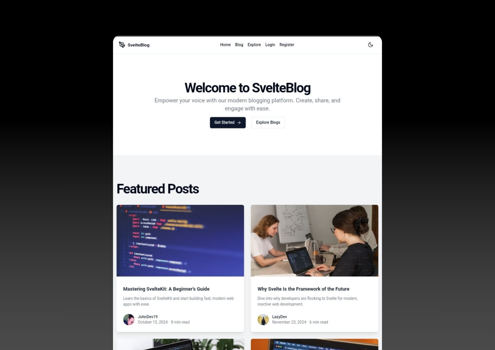

# SvelteBlog

SvelteBlog is a modern, user-friendly blogging platform built with SvelteKit, Tailwind CSS, and shadcn/ui. It provides a responsive and aesthetically pleasing interface for both writers and readers.

## Project Status: Startup / In Development

This project is currently in its initial stages of development. It serves as a foundation for a full-featured blogging platform but requires further implementation of some functionalities.

## Features (Planned)

- User authentication (login, register, logout)
- Create, edit, and delete blog posts
- Rich text editor for writing blog posts
- Responsive design for all devices
- Dark mode support
- Admin dashboard for managing posts and users
- Explore page to discover new blogs and authors
- Search functionality for finding specific content

## Tech Stack

- SvelteKit 2
- Svelte 5
- Tailwind CSS
- shadcn/ui
- TypeScript

## Future Development Needs

The following areas need to be implemented to make this a fully functional blogging platform:

1. **Database Integration**: Implement a database system (e.g., PostgreSQL) to store user data, blog posts, and other necessary information.

2. **User Authentication**: Develop a robust user authentication system, including registration, login, and logout functionalities.

3. **Admin Panel**: Create an admin dashboard for managing users, posts, and site settings.

4. **Blog Post CRUD Operations**: Implement full Create, Read, Update, and Delete operations for blog posts.

5. **Comment System**: Add the ability for users to comment on blog posts and manage those comments.

6. **User Profiles**: Develop user profile pages where bloggers can customize their information and readers can learn about authors.

7. **Search Functionality**: Implement a search feature to allow users to find specific posts or topics.

8. **Tagging and Categorization**: Add the ability to tag and categorize blog posts for better organization and discoverability.

9. **Social Sharing**: Integrate social media sharing capabilities for blog posts.

10. **SEO Optimization**: Implement SEO best practices to improve the discoverability of blog content.

11. **Performance Optimization**: Ensure the application is optimized for speed and efficiency, especially when handling a large number of posts and users.

12. **Testing**: Develop a comprehensive testing suite to ensure reliability and catch bugs before deployment.

## Contributing

As this is a startup project, contributions are welcome! If you're interested in helping develop this blogging platform, please feel free to fork the repository and submit pull requests.

## License

This project is licensed under the MIT [LICENSE](LICENSE).

